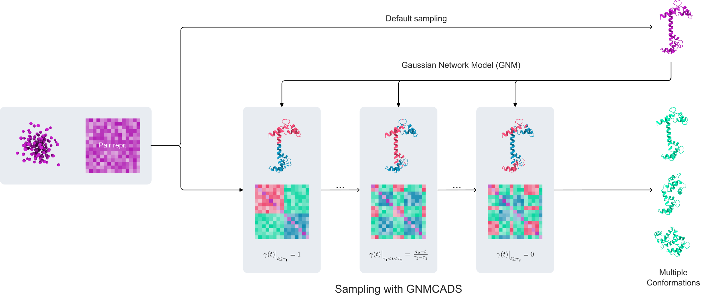

# AF3 GNMCADS



Coming soon! 

## Citation

If you use GNMCADS in your research, please cite:
```bibtex
@article {Uzum2026.08.28.747885,
	author = {Uzum, Ahmed Selim and Haliloglu, Turkan},
	title = {GNMCADS: Sampling For Protein Conformation Diversity With Gaussian Network Model Guided Condition Annealed Diffusion Sampler},
	elocation-id = {2026.08.28.747885},
	year = {2026},
	doi = {10.64898/2026.08.28.747885},
	publisher = {Cold Spring Harbor Laboratory},
	abstract = {Proteins are dynamic molecules existing in diverse conformational states underlying their biological functions. Although recent approaches have enabled diverse conformational sampling by emulating molecular dynamics simulations, perturbing evolutionary information, or steering internal mechanisms of structure prediction models, predicting conformations resulting from major domain motions or motions that occur over long timescales still remains a challenge. To this end, we introduce GNMCADS, a conformational sampling strategy that enhances the diversity of protein diffusion models by selectively annealing the conditioning signal guided by the intrinsic dynamical organization of the sampled protein. Further, we implement GNMCADS in the diffusion module of AlphaFold3, enabling the generation of diverse protein conformations. When benchmarked across 92 proteins that include 54 class A GPCRs, 15 transporters, and 23 proteins with major domain movements, GNMCADS exhibits improved sampling diversity compared to other current conformational sampling methods.Competing Interest StatementThe authors have declared no competing interest.Bo\&amp;$\#$287;azi{\c c}i University, https://ror.org/03z9tma90, 25A05P4},
	URL = {https://www.biorxiv.org/content/early/2026/08/28/2026.08.28.747885},
	eprint = {https://www.biorxiv.org/content/early/2026/08/28/2026.08.28.747885.full.pdf},
	journal = {bioRxiv}
}
```

If you use AF3 GNMCADS in your research, please also cite:
```bibtex
@article{Abramson2024,
  author  = {Abramson, Josh and Adler, Jonas and Dunger, Jack and Evans, Richard and Green, Tim and Pritzel, Alexander and Ronneberger, Olaf and Willmore, Lindsay and Ballard, Andrew J. and Bambrick, Joshua and Bodenstein, Sebastian W. and Evans, David A. and Hung, Chia-Chun and O’Neill, Michael and Reiman, David and Tunyasuvunakool, Kathryn and Wu, Zachary and Žemgulytė, Akvilė and Arvaniti, Eirini and Beattie, Charles and Bertolli, Ottavia and Bridgland, Alex and Cherepanov, Alexey and Congreve, Miles and Cowen-Rivers, Alexander I. and Cowie, Andrew and Figurnov, Michael and Fuchs, Fabian B. and Gladman, Hannah and Jain, Rishub and Khan, Yousuf A. and Low, Caroline M. R. and Perlin, Kuba and Potapenko, Anna and Savy, Pascal and Singh, Sukhdeep and Stecula, Adrian and Thillaisundaram, Ashok and Tong, Catherine and Yakneen, Sergei and Zhong, Ellen D. and Zielinski, Michal and Žídek, Augustin and Bapst, Victor and Kohli, Pushmeet and Jaderberg, Max and Hassabis, Demis and Jumper, John M.},
  journal = {Nature},
  title   = {Accurate structure prediction of biomolecular interactions with AlphaFold 3},
  year    = {2024},
  volume  = {630},
  number  = {8016},
  pages   = {493–-500},
  doi     = {10.1038/s41586-024-07487-w}
}
```
